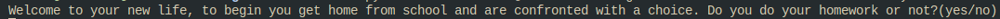
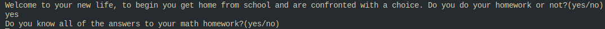
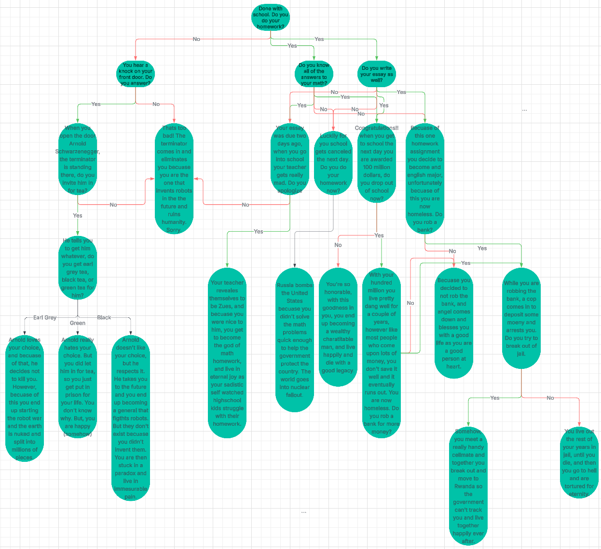

<p style="text-align:center;font-size:30px;">Dylan Soule's Life Decision Simulator</p>

----------------------

The Life Decision Simulator tells a choose your own adventure type story through the terminal.  
Through each branching path you will get to crazy endings that you couldn't even imagine.

## Requirements
* Python 3

## Installation
* Download the [decision_tree.py](./decision_tree.py) file  
* Import the file into a code running software such as vscode  
* Run the file

## How to Play
Begin by running the file, one way to do this is shown below
```sql
cd [file path to decision_tree.py] | python3 decision_tree.py
```
After you run the file you will be given the first part of the story and prompted with a yes or no decision
  

Answer the prompt, and make sure you spell yes or no correctly, and you will be prompted with the next step


Continue playing until you reach an ending, then the program will end

## Program Flow
* The Program Runs based on specific outcomes defined in the flow chart [here](https://lucid.app/lucidchart/38ef8760-e41d-4c3f-8eb3-f12a53836a7d/edit?viewport_loc=-1484%2C269%2C6711%2C3620%2C0_0&invitationId=inv_4e7db0bc-7d50-400a-8cd2-18c5eaaacfd3), or shown below


